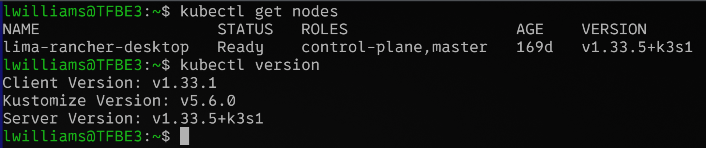
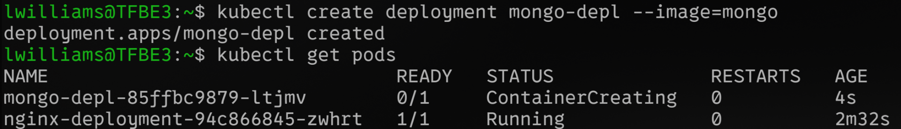
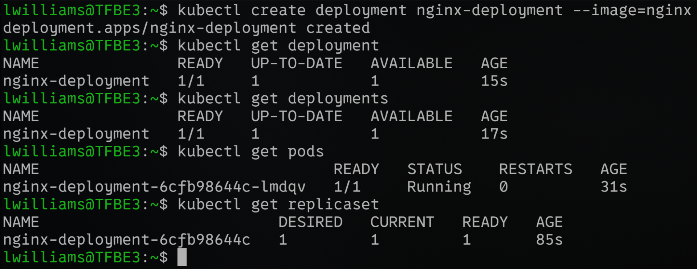
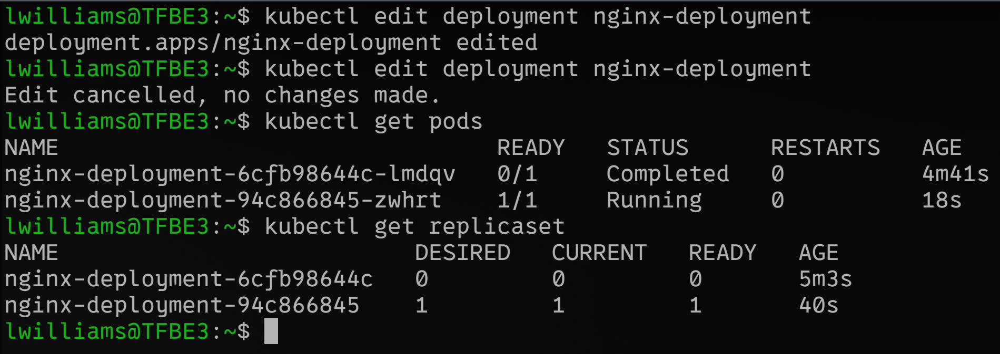
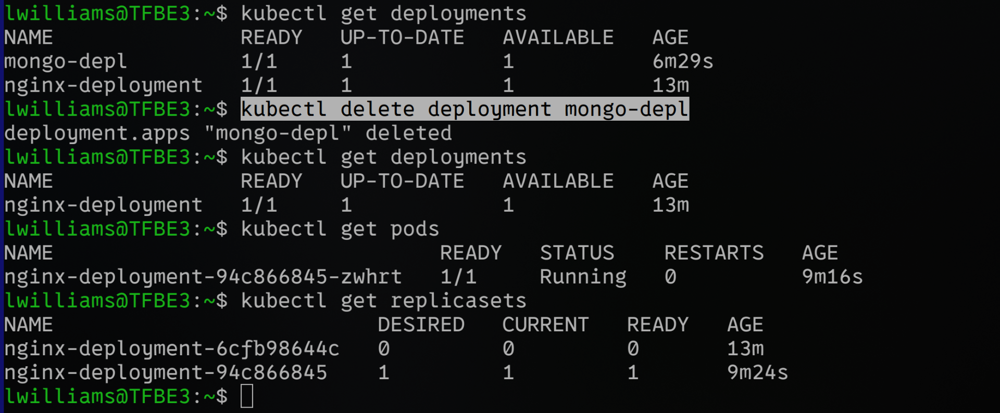

# Introduction

- Demand came from rise of container technologies and microservices
- K8s orchastration gives:
    - HA
    - Scalability
    - Disaster Recovery
- Fundamental components
    - Objects
        - Node - Abstraction over a server in a K8s cluster that runs 1+ pod
        - Pod - Smallest unit; abstraction over a container
            - Each pod gets its own IP
            - Internal communication between pods using IP
            - Ephemeral
        - Service - Load Balancer with Static IP that can be attached to a pod
            - Not connected to lifecycle of pod
            - External Service - Service that opens communication from public sources (Node IP, Port number); not good for end product
            - Internal Service - Service you create for internal communication
        - Ingress
            - Replaces External service; in AWS launches and configures ALB
            - Routes traffic to inside the cluster
        - ConfigMap - External config to app; can be used to store URL config,etc.
            - Not good for secrets
        - Secret - External config for secrets like creds, certs; base64 encoded
        - Volumes - Attaches physical storage on HDD/SSD to pod (can be remote or local)
            - Can be used to persist data
        - Deployment - Blueprint for **stateless** pod management; ensure Replicas
            - Abstraction over pods; works with services to ensure HA
        - StatefulSet - useful to manage **stateful** pods (DBs)
            - Important to prevent data inconsistencies
            - Bit tedious to manage; DBs are generally deployed outside K8s
    - Architecture:
        - Master Node / Control Plane - Only management so require less resources
            - API server - Core component server that exposes K8s API
            - scheduler - Assigns each Pod to a suitable worker node; actual pod management done at node by kubelet
            - kube-controller-manager - detects state changes and keeps them in desired state
            - etcd - Consistent and HA k-v store for cluster state info; brain/data store of the cluster; does not store app data
            - cloud-c-m (optional) - Integrates with underlying Cloud provider
        - (Worker) Node - Cluster of servers that actually do the work; so resource-heavy
            - Container runtime - Software responsible for running containers (docker, containerd)
            - kubelet - Ensures pods, incl their containers are running; does actual scheduling at node level
            - kube-proxy - Ensures smart communication between pods and services
    - kubectl - CLI tool to interact with k8s cluster
    - Local setup
        - 
        - 
    - ReplicaSet - An abstraction between a pod and a deployment that manages # of replicas; would never have to manage it manually
        - 
    - Editing deployment
        - 
    - Debugging
        - kubectl logs &lt;pod-name&gt;
        - kubectl describe pod &lt;pod-name&gt;
        - Reach the container terminal: kubectl exec -it &lt;pod-name&gt; -- bin/bash
            
    - Delete deployment
        - kubectl delete deployment &lt;deployment-name&gt;
        - 
    - Normally it is chatoic to work with CLI so we work with conf files
    - When you apply changes to yaml deployments (kubectl apply -f &lt;yaml-filename.yaml&gt;), generally the oldest running pod persists.

# Kubernetes YAML

## Syntax

- 3 parts:
    - Name - Name of deployment
    - Specifications (spec) -- Depends on the "kind" of deployment
    - Status - Automatically generated by k8s from etcd; basis of self-healing; needs to be removed if we are copying from output to re-deploy
- Inside of a "deployment" there will be blueprint for pods
- Labels and Selectors: That's how connections are established
    - Metadata has labels
    - Spec has selectors; they establish connection for pods and for service to pods
- Ports in service and pod
    - Deployment has defined the exposed port (container port)
    - Service defines protocol, the port it itself exposes (port) and target port (the port of the pod it connects to)
    - Selector is used to determine which pod it connects to
- Order of apply matters. Eg - Secrets need to be applied before they can be referenced in a deployment

# Namespaces

- A way to organize/group cluster in k8s cluster; Virtual cluster within our k8s cluster; Can be created by config file
- Default (non-local): 4 - kube-system (system processes), kube-public (public data configmap), kube-node-lease (heartbeat of node), default (for creating resources)
- Each deployment will be unique to its namespace; best to keep 1 per team/project component
- Also useful for blue-green deployment
- Limit access and resources (CPU, RAM, Storage)
- ConfigMaps and Secrets are generally not accessible across namespaces
- Services can be shared between namespaces
- Global components: Volume, PersistantVolume, Node

# Kubernetes Ingress

- External service access is not ideal for deployment; ingress is better instead using https
- External Service used NodePort (type was Load Balancer); Inernal Service will use ClusterIP not LoadBalance
- Ingress defines routing rules; host, path (backend name and service port)
- Depends on Ingress Controller pod (eg-nginx ingress controller) which we need to define and install
    - Cloud Providers (think EKS, GKE, AKE) may place a Load Balancer in front of the Ingress Controller
    - If going bare metal, it can be manually managed
- If no backend is defined, a default backend is configured for port 80
- Can be used for defining different services for different urls or sub-domains from a single service
- Configuring TLS certs - Easy to do; just need to include in secrets and ref secret name in tls flags

# Helm (Package Manager for k8s)

- Packages standard YAML files - like if pip-based templating engine for python frameworks
- These bundles are called Helm charts
- Can be public (helm hub) or private (companies host their own)
- Removes the need to manage multiple repetitive YAML files - Best for CI/CD
- Also helpful for different values across different namespaces/ k8s tenants
- Chart dir structure
    - Chart.yaml - metadata
    - values.yaml - Template file values
    - charts/ - dependancies
    - templates/ - template files
- Can override default values using that will be compiled into a single values object:
    - helm install --values=my-values.yaml &lt;chartname&gt;
- Easy rollback using helm rollback; tiller removed in Helm 3

# Data Persistence with Volumes

- Persistant Volume
    - Interface over physical storage; managed by admin
    - Created via YAML to define how much storage needed
    - Can specify which storage backend to use; specs depend on backend (local, gcp, azure, aws ebs, aws efs)
    - **PV is namespaced**
    - Local volumes are equally tied to each node (remote ones are 1 per node); also questionable if they will survive cluser/node crash
    - Underlying resources referenced need to exist before they are used by PV
- Persistent Volume Claim
    - PV is allocation of resources; PVC is the defined use of those resources by dev
    - Defined in YAML; whichever PV matches PVC, it will be used
    - **Claims are namespaced**
    - A pod can use different volumes simultaneously
- StorageClass
    - See how PVC requires a PV to exist and PV needs a physical resource to exist? Managing it can become tedious quickly
    - SC provisions PV dynamically; provisioner can be specified here (internal and external)
    - It is also claimed by PVC; unlike PV that required harware to be pre-provisioned, SC provisions the PV on the go

# Deploying Stateful apps with Stateful Sets

- Deployment but for stateful app like dbs
- Possible to run multiple replicas just like deployments; replica pods for STS are not identical/interchangable
- Addresses challanges on deletion and how to handle crashes gracefully (these problems don't exist in stateless apps)
- Implement Master, Slave + don't have same physical volumes
- Implement PV with STS for data persistance in case of all STS pods crash - **important to use remote storage**
    - Stateful Sets require fixed and ordered name
    - Deletion for deployment is random but for statefulset is fixed; one created at last is deleted first
- Each pod gets its own DNS service
- Pods get sticky identity; pod restarts at IP change; name and endpoint remains same
- Cloning and Data sync + Remote setup can be complex; this is **not ideal use case for container**

# **Different types of Services**

- Service is basically an abstraction over IP address that makes it seem persistent and can be linked to a pod; services span all worker nodes
- 4 types:
    - ClusterIP
        - default; internal service - only accessible from within cluster
        - Will get IP from Node's range
        - Can be linked to pods using (label) selector of pods
        - Which port to target will be addressed using target port attribute
        - For multi-port services, each service needs to be independently named
    - Headless
        - When client wants to talk with a specific pod directly
        - Discovery using DNS lookup instead of making lookup call to K8s API;
        - set clusterIp to None
    - NodePort
        - External traffic accessible on 1 port
        - Range - 30000-32767
    - LoadBalancer
        - Service becomes accessible through Cloud Provider's Load Balancer
        - Basically an extension of nodeport type but LB management makes it more secure

&nbsp;